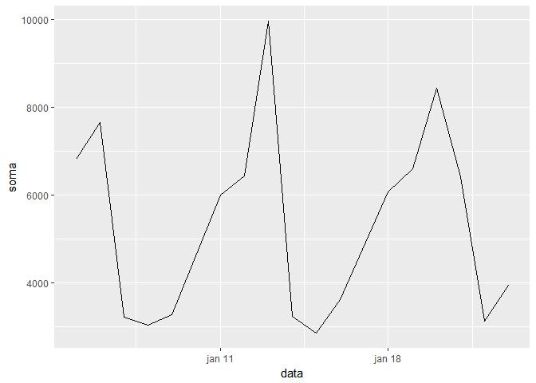
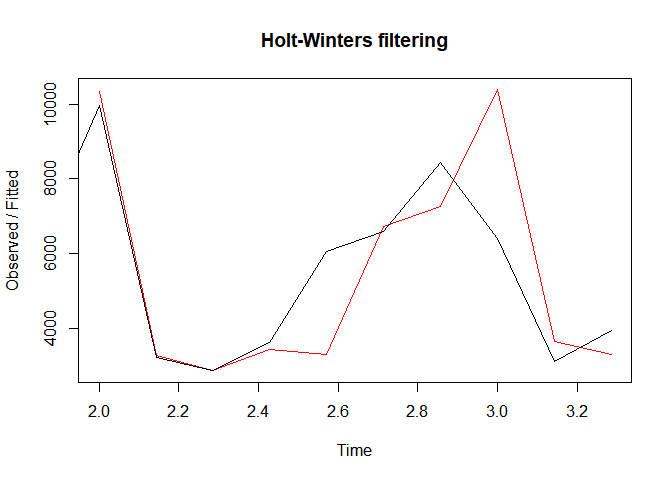
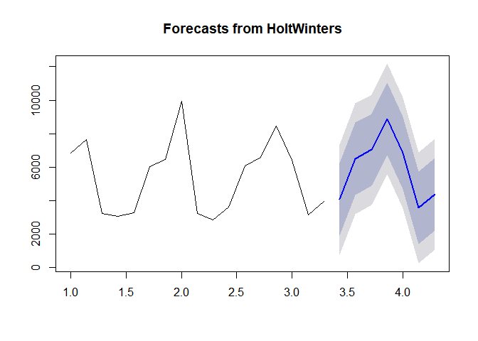
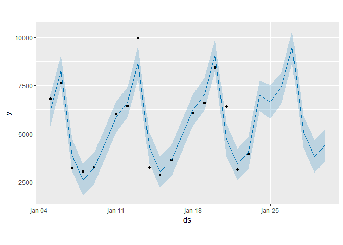

TOTVS Forecast
================

Data Challenge
--------------

### Motivation

This challange was taken in order to persuit a position in TOTVS labs and also for improvement of my skills and challenge myself to do my best in Data Science process.

### The Data Challenge given

> Using the given dataset of transactions (notas fiscais eletrônicas) from a restaurant:
> <https://github.com/TOTVS/MDMStatic/blob/master/code-challenge/TOTVS%20Labs%20-%20AI%20Challenge%20-%20Dataset.zip?raw=true>
> 1. Parse and extract the data.
> 2. Identify a pattern on any set of fields that can help predict how much a customer will spend.
> 3. Calculate a sales forecast for the next week.
> We recommend that you spend not more than 5 hours on the challenge.
> Evaluation criteria
> 1. Ability to read/parse a dataset from a file.
> 2. Understanding of common business data.
> 3. Basic knowledge of artificial intelligence.
> 4. Ability to build a model to identify correlations and patterns between fields.
> 5. Code design
> 6. Ability to write clear documentation
> 7. BONUS: Ability to build a forecast model.
> Submission
> 1. A link to the github repository.
> 2. Briefly explain the models that you used/built

### Start

Looking at the sample.txt we recognise a json structure, thus we have as a starting option to parse the data with the jsonlite package to analyse the data structure.

``` r
library(jsonlite)
library(tidyverse)
library(forecast)
```

Simply we just call the function read\_json

``` r
dataSample <- read_json("sample.txt")
```

So now, we can see that the data has the format of list of list.

Looking at the data carefully we can see that the majority of fields are just repetitions, and it is related to the business it self like phone number, cnpj, etc.. We are looking for field that give us meaning. For the analysis we stay with the product, date and value of the product.

We can extract each product sold in each sell by doing two for loops, one for every product sold in a especific selling and one for statment for each sell action. Once we want to predict how much the costumers will buy, we will focus on the products sold and not on the billing itself.

But first we create a data frame that we will apend each loop created. And we name the rows.

``` r
dataFrame <- data.frame(matrix(ncol = 3))

colnames(dataFrame) <- c("produto","valorUnitario","data")
```

Now we have the following code for the loop:

``` r
for (n in c(1:as.numeric(length(dataSample)))){
  
  for (i in c(1:as.numeric(length(dataSample[[n]]$dets))))  {
    
    produto <- dataSample[[n]]$dets[[i]]$prod$xProd
    valorunidade <- dataSample[[n]]$dets[[i]]$prod$vProd
    data <-  dataSample[[n]]$ide$dhEmi$`$date`
    
    
    dataFrame <- rbind(dataFrame,c(produto,valorunidade,data))
  }
}
```

Now that we have a clean data frame we have to check and transform the class (type) of the variables. Just check by doing:

``` r
sapply(dataFrame, class)
```

    ##       produto valorUnitario          data 
    ##   "character"   "character"   "character"

``` r
head(dataFrame)
```

    ##        produto valorUnitario                     data
    ## 1         <NA>          <NA>                     <NA>
    ## 2         AGUA           3.5 2016-01-05T12:01:54.000Z
    ## 3       BUFFET          21.4 2016-01-05T12:01:54.000Z
    ## 4       BUFFET         83.55 2016-01-05T12:03:52.000Z
    ## 5 REFRIGERANTE             9 2016-01-05T12:03:52.000Z
    ## 6         SUCO           4.5 2016-01-05T12:16:40.000Z

Lets change the classes and remove the first row:

``` r
dataFrame$produto <- as.factor(dataFrame$produto)
dataFrame$valorUnitario <- as.double(dataFrame$valorUnitario)
dataFrame$data <- as.Date(dataFrame$data)

dataFrame <-  dataFrame[-1,]
```

Now we group and summarise the data, so we can use it anallyticaly:

``` r
vendasPorData <- dataFrame %>%
  group_by(data) %>% 
  summarise(soma = sum(valorUnitario))
```

Time series
-----------

We get the following results:

``` r
head(vendasPorData)
```

    ## # A tibble: 6 x 2
    ##   data        soma
    ##   <date>     <dbl>
    ## 1 2016-01-05  6822
    ## 2 2016-01-06  7648
    ## 3 2016-01-07  3226
    ## 4 2016-01-08  3051
    ## 5 2016-01-09  3274
    ## 6 2016-01-11  6011

Lets plot and see what we have.

``` r
ggplot(vendasPorData,
       aes(x=data,
           y=soma))+
  geom_line() 
```



We have 3 weeks of data. Now we just use the time series function 'ts()' with a frquency of a week (frequency=7).

``` r
timeSeriesVendas <- ts(vendasPorData$soma, frequency = 7)
```

And we create a HoltWinters model using the HoltWinters() function

``` r
HWModel <- HoltWinters(timeSeriesVendas)
```

Our model can be seen as follow:

``` r
plot(HWModel)
```



Forecasting
-----------

We can plot the predicted sales with a 80% and 95%

``` r
plot(forecast(HoltWinters(timeSeriesVendas), 7))
```



The results are just like expected. The fitted and the forecast follow the sasonality, the prediction has a very good residuals and trends bys just two weeks of data.

Using prophet for Forecast
--------------------------

The same way we can use the prophet package. No changes have to be made just like the previous model due the structure of the time-series.

``` r
library(prophet)
dataFrameProphet <- vendasPorData
colnames(dataFrameProphet) <- c("ds","y")
dataFrameProphet$y <- as.double(dataFrameProphet$y)

ProphetModel <- prophet(dataFrameProphet)
```

    ## Initial log joint probability = -2.46851
    ## Optimization terminated normally: 
    ##   Convergence detected: absolute parameter change was below tolerance

``` r
future <- make_future_dataframe(ProphetModel, periods = 7)
forecast <- predict(ProphetModel, future)
plot(ProphetModel, forecast)
```



Considerations
--------------

The Prophet package shows us a smaller 80% y-interval, but in both models the trends are similar. Both are good models to improve and to analyse closer with at least two years of data.

We could also use the "Mesa" (tables) as variable, certainly they will have different percentage of using, and maybe it will have some weight on how much the costumer consume, but due the short time i dont think it will change the overall spent in a week.

We also could use the products as factors to make another model, but the first tougth in my mind was that the time that the especific product is most consumed and the mean of consuption of the type of product (BEER for example) is implicit when we have a seasonal model.

And the last thing to say is that the data could be parsed in a easier way for this model, but during the process i changed the focus. I was going to use the products, so it is unnecessary. and we could have only the total billing and the date, could be easier with fromJSON package.

Thankx :)

Any question, find me at <vinicius.lucena.souza@gmail.com>
